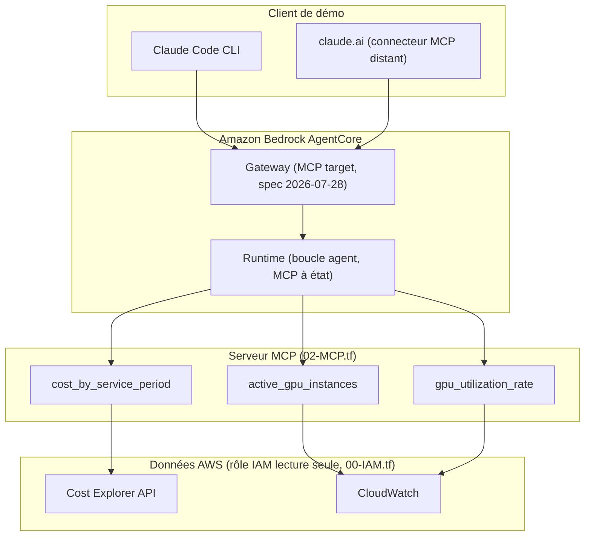
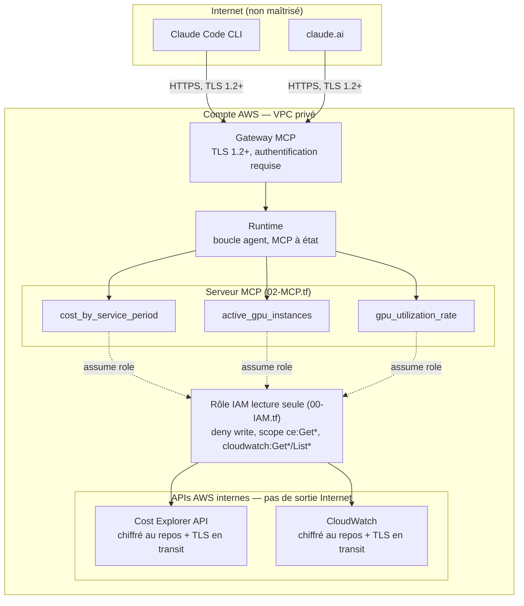

# AWS FinOps Agent with MCP

Agent conversationnel qui répond en langage naturel à des questions sur les coûts et l'utilisation de sa propre infrastructure AWS, exposé comme serveur MCP et hébergé sur Amazon Bedrock AgentCore.

## Fonctionnalités

- « Combien m'ont coûté mes instances GPU les 7 derniers jours ? » (AWS Cost Explorer)
- « Quelles instances tournent avec un GPU sous-utilisé ? » (CloudWatch)
- « Quel est mon coût par million de tokens servis ? »

## Architecture

- **Hébergement** : Amazon Bedrock AgentCore (Runtime + Gateway)
- **Données** : AWS Cost Explorer API et CloudWatch, via un rôle IAM strictement en lecture seule
- **Déploiement** : Terraform (`00-IAM.tf`, `01-BEDROCK.tf`, `02-MCP.tf`)
- **Protocole** : les outils sont exposés comme un serveur MCP plutôt qu'un schéma d'outils propriétaire Bedrock

## Sécurité

- **Frontière internet / AWS** : seul le Gateway MCP est exposé publiquement, en HTTPS/TLS 1.2+ avec authentification requise ; le Runtime, le serveur MCP et les appels aux API AWS restent internes au compte (pas de sortie internet depuis Cost Explorer / CloudWatch)
- **Chiffrement** : TLS en transit sur tous les flux (client → Gateway, appels API AWS), chiffrement au repos natif sur Cost Explorer et CloudWatch
- **Moindre privilège** : rôle IAM dédié, lecture seule (`ce:Get*`, `cloudwatch:Get*`/`List*`), aucune permission d'écriture — défini dans `00-IAM.tf`

## Démo

*(captures d'écran / asciinema à ajouter — démo via Claude Code CLI et/ou un connecteur MCP distant sur claude.ai)*

## Contexte du projet

Scope, décisions et critère d'arrêt : voir [finops-mcp-agent.md](finops-mcp-agent.md).
