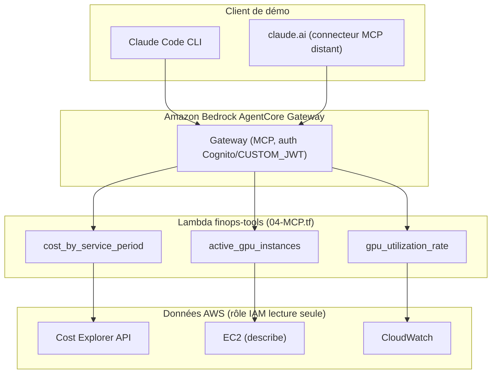
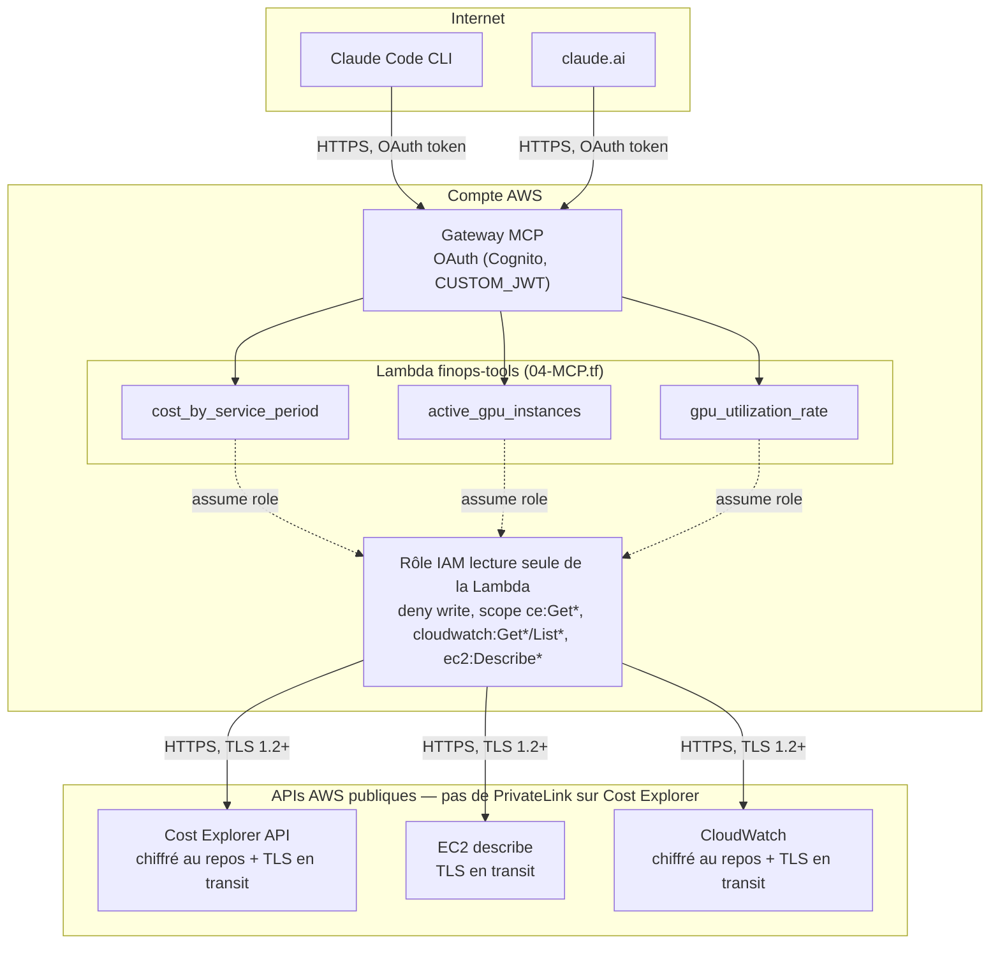

# AWS FinOps Agent with MCP

Agent conversationnel qui répond en langage naturel à des questions sur les coûts et l'utilisation de sa propre infrastructure AWS, exposé comme serveur MCP et hébergé sur Amazon Bedrock AgentCore.

## Fonctionnalités

- « Combien m'ont coûté mes instances GPU les 7 derniers jours ? » (AWS Cost Explorer)
- « Quelles instances tournent avec un GPU sous-utilisé ? » (CloudWatch)
- « Quel est mon coût par million de tokens servis ? »

## Architecture

- **Hébergement** : Amazon Bedrock AgentCore Gateway (MCP), authentification OAuth via Cognito (`CUSTOM_JWT`)
- **Outils** : une Lambda (`finops-tools`) implémente les 3 outils, enregistrée sur le Gateway comme cible MCP
- **Données** : AWS Cost Explorer API, EC2 et CloudWatch, via un rôle IAM strictement en lecture seule
- **Déploiement** : Terraform (`00-IAM.tf`, `03-BEDROCK-gateway.tf`, `04-MCP.tf` — `01-ECR.tf`/`02-BEDROCK-runtime.tf` sont un chantier annexe optionnel, voir plus bas)
- **Protocole** : les outils sont exposés comme un serveur MCP plutôt qu'un schéma d'outils propriétaire Bedrock

Un Runtime AgentCore conteneurisé (`01-ECR.tf`, `02-BEDROCK-runtime.tf`) existe aussi dans le repo mais n'est **pas nécessaire à cette démo** : Claude Code CLI et claude.ai fournissent déjà leur propre boucle agent et parlent directement au Gateway ci-dessus. Il est gardé de côté comme chantier exploratoire pour tester, séparément, un agent autonome invocable en dehors de tout client MCP (nécessite encore un Dockerfile + du code, non écrit).

## Sécurité

- **Réseau** : pas de VPC privé — choix délibéré, pas un oubli : AWS Cost Explorer n'a pas de support VPC PrivateLink, donc même en subnet privé il aurait fallu un NAT Gateway (~35$/mois) pour l'atteindre, sans gain de sécurité réel puisque le trafic reste public dans les deux cas. Détail complet dans [finops-mcp-agent.md](finops-mcp-agent.md#retour-dexpérience--réseau-public-vs-vpc-privé-13-septembre-2026).
- **Chiffrement** : TLS en transit sur tous les flux (client → Gateway MCP, Lambda → API AWS), chiffrement au repos natif sur Cost Explorer et CloudWatch
- **Authentification** : le Gateway MCP exige un token OAuth (Cognito, `CUSTOM_JWT`) pour tout appel entrant
- **Moindre privilège** : la Lambda `finops-tools` a son propre rôle IAM dédié, lecture seule (`ce:Get*`, `cloudwatch:Get*`/`List*`, `ec2:Describe*`), aucune permission d'écriture — le rôle du Gateway, séparé, ne peut qu'invoquer cette Lambda

## Démo

*(captures d'écran / asciinema à ajouter — démo via Claude Code CLI et/ou un connecteur MCP distant sur claude.ai)*

## Contexte du projet

Scope, décisions et critère d'arrêt : voir [finops-mcp-agent.md](finops-mcp-agent.md).
