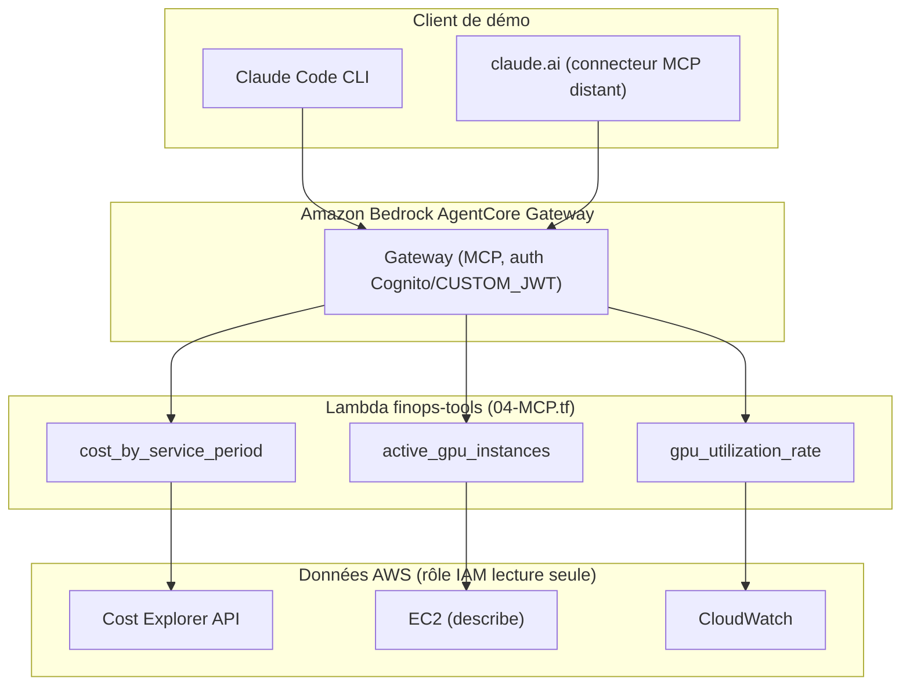
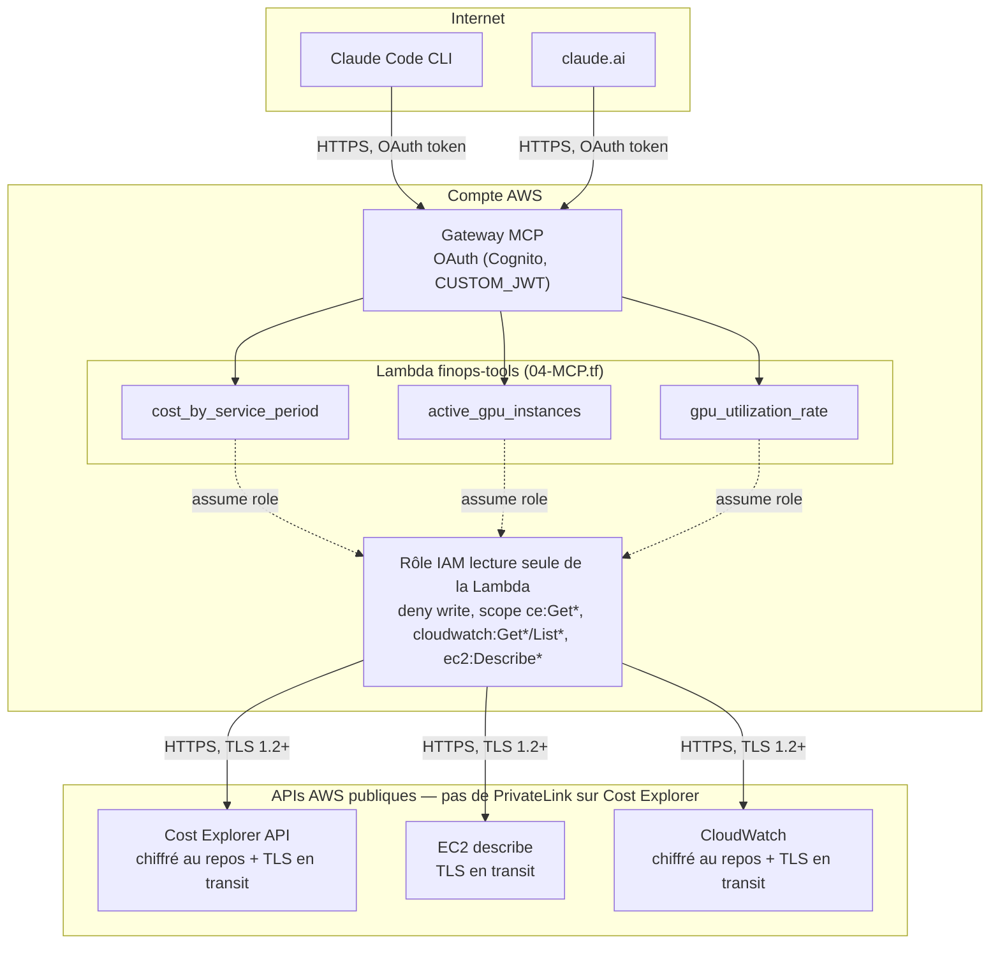

# AWS FinOps Agent with MCP

[](https://www.terraform.io/)
[](https://registry.terraform.io/providers/hashicorp/aws/latest)
[](https://www.python.org/)
[](https://modelcontextprotocol.io/)
[](https://opensource.org/licenses/Apache-2.0)
[](https://www.linkedin.com/in/julien-p-68834731/?locale=fr)

Agent conversationnel qui répond en langage naturel à des questions sur les coûts et l'utilisation de sa propre infrastructure AWS, exposé comme serveur MCP et hébergé sur Amazon Bedrock AgentCore.

## Fonctionnalités

- « Combien m'ont coûté mes instances GPU les 7 derniers jours ? » (AWS Cost Explorer)
- « Quelles instances tournent avec un GPU sous-utilisé ? » (CloudWatch)
- « Quel est mon coût par million de tokens servis ? »

## Pourquoi c'est agentique, et pourquoi MCP

Ce n'est pas un LLM qui répond depuis ses connaissances générales sur AWS — c'est un système où l'agent décide lui-même quels outils appeler, dans quel ordre et avec quels paramètres, pour répondre à une question qu'il n'a jamais vue formulée exactement comme ça. Le split entre outils (3 fonctions étroites et déterministes : coût, instances GPU, utilisation) et agent (la boucle qui orchestre) est le cœur de la démarche : pas un pipeline figé, un plan généré à la volée.

L'exemple qui me plaît le plus pour illustrer ça :

> « Quelles instances tournent avec un GPU sous-utilisé ? » n'existe comme fonction nulle part dans `handler.py`. L'agent doit décomposer tout seul : lister les instances GPU actives, interroger le taux d'utilisation de chacune, corréler les deux résultats, et appliquer un seuil pour juger "sous-utilisé". Personne n'a écrit cette logique de composition — elle émerge du raisonnement de l'agent sur les 3 outils disponibles.

Ça infuse aussi l'architecture : le rôle IAM lecture seule, l'authz sur le Gateway, tout ça existe parce qu'on donne un accès réel — bien que restreint — à de l'infra de prod à un système autonome, pas à un chatbot qui répondrait depuis un dashboard pré-calculé.

Côté protocole, j'ai délibérément choisi MCP plutôt que le schéma d'action groups propriétaire de Bedrock, alors que ce dernier aurait été tout aussi capable techniquement. La raison est stratégique plus que technique : MCP découple les outils du client qui les consomme. Les mêmes 3 tools servent à Claude Code CLI et à claude.ai sans écrire deux intégrations différentes — avec un schéma Bedrock, ce choix n'existerait pas, ce serait Bedrock ou rien. Et si demain le modèle change, un `aws_bedrockagentcore_gateway_target` en MCP reste utilisable, alors qu'un schéma d'action group est jetable dès qu'on change d'écosystème agent. C'est le pari de la commoditisation évoqué dans [finops-mcp-agent.md](finops-mcp-agent.md) : si n'importe quel modèle sait de mieux en mieux faire du tool-use, la valeur se déplace du modèle vers la couche d'intégration — et c'est cette couche-là que ce projet met en avant.

## Architecture

- **Hébergement** : Amazon Bedrock AgentCore Gateway (MCP), authentification OAuth via Cognito (`CUSTOM_JWT`)
- **Outils** : une Lambda (`finops-tools`) implémente les 3 outils, enregistrée sur le Gateway comme cible MCP
- **Données** : AWS Cost Explorer API, EC2 et CloudWatch, via un rôle IAM strictement en lecture seule
- **Déploiement** : Terraform (`00-IAM.tf`, `03-BEDROCK-gateway.tf`, `04-MCP.tf` — `01-ECR.tf`/`02-BEDROCK-runtime.tf` sont un chantier annexe optionnel, voir plus bas)
- **Protocole** : les outils sont exposés comme un serveur MCP plutôt qu'un schéma d'outils propriétaire Bedrock



Un Runtime AgentCore conteneurisé (`01-ECR.tf`, `02-BEDROCK-runtime.tf`) existe aussi dans le repo mais n'est **pas nécessaire à cette démo** : Claude Code CLI et claude.ai fournissent déjà leur propre boucle agent et parlent directement au Gateway ci-dessus. Il est gardé de côté comme chantier exploratoire pour tester, séparément, un agent autonome invocable en dehors de tout client MCP (nécessite encore un Dockerfile + du code, non écrit).

## Sécurité

- **Réseau** : pas de VPC privé — choix délibéré, pas un oubli : AWS Cost Explorer n'a pas de support VPC PrivateLink, donc même en subnet privé il aurait fallu un NAT Gateway (~35$/mois) pour l'atteindre, sans gain de sécurité réel puisque le trafic reste public dans les deux cas. Détail complet dans [finops-mcp-agent.md](finops-mcp-agent.md#retour-dexpérience--réseau-public-vs-vpc-privé-13-septembre-2026).
- **Chiffrement** : TLS en transit sur tous les flux (client → Gateway MCP, Lambda → API AWS), chiffrement au repos natif sur Cost Explorer et CloudWatch
- **Authentification** : le Gateway MCP exige un token OAuth (Cognito, `CUSTOM_JWT`) pour tout appel entrant
- **Moindre privilège** : la Lambda `finops-tools` a son propre rôle IAM dédié, lecture seule (`ce:Get*`, `cloudwatch:Get*`/`List*`, `ec2:Describe*`), aucune permission d'écriture — le rôle du Gateway, séparé, ne peut qu'invoquer cette Lambda
- **Durcissement IAM différé, volontairement** : la trust policy du rôle du Gateway (`00-IAM.tf`) autorise `bedrock-agentcore.amazonaws.com` à assumer le rôle sans condition `aws:SourceAccount`/`aws:SourceArn` ("confused deputy" — n'importe quel Gateway AgentCore de n'importe quel compte pourrait en théorie l'assumer). Ce n'est pas un oubli : la [doc AWS](https://docs.aws.amazon.com/bedrock-agentcore/latest/devguide/gateway-prerequisites-permissions.md) recommande explicitement d'omettre cette condition tant que le Gateway n'existe pas encore (son ARN n'est connu qu'après création), puis de l'ajouter après un premier `terraform apply` avec l'ARN réel. À faire dès que le compte AWS est actif — voir la liste de suivi dans [finops-mcp-agent.md](finops-mcp-agent.md).



## Tests

Les 3 fonctions outils de `lambda/finops-tools/handler.py` sont testées unitairement (boto3 mocké, `moto`/compte AWS non nécessaires) :

```bash
cd lambda/finops-tools
python3.12 -m venv .venv && .venv/bin/pip install -r requirements-dev.txt
.venv/bin/pytest
```

## Configurer un client MCP

Une fois `terraform apply` fait, les [outputs](03-BEDROCK-gateway.tf) donnent tout ce qu'il faut pour connecter un client — rien à aller chercher dans la console AWS.

**1. Obtenir un token OAuth** (flow `client_credentials`, Cognito) :

```bash
ACCESS_TOKEN=$(curl -s -X POST "$(terraform output -raw cognito_token_url)" \
  -u "$(terraform output -raw cognito_client_id):$(terraform output -raw cognito_client_secret)" \
  -d "grant_type=client_credentials&scope=$(terraform output -raw cognito_oauth_scope)" \
  | jq -r .access_token)
```

Le token expire (1h par défaut côté Cognito) — pour une démo CLI ponctuelle ça suffit, pas de rafraîchissement automatique mis en place.

**2. Claude Code CLI** — supporte un header statique, donc directement utilisable :

```bash
claude mcp add --transport http finops "$(terraform output -raw gateway_url)" \
  --header "Authorization: Bearer ${ACCESS_TOKEN}"
```

**3. claude.ai (connecteur distant)** — **non vérifié, point d'attention à la première tentative réelle** : l'UI des connecteurs personnalisés attend en standard un flow OAuth interactif (authorization code, avec consentement utilisateur dans le navigateur), alors que le Gateway ici utilise `client_credentials` (machine-to-machine, sans utilisateur). Un header statique (`Authorization: Bearer`) est supporté en bêta côté claude.ai mais configurable seulement par un admin d'organisation, à vérifier disponible au moment du test. Si ni l'un ni l'autre ne passe, Claude Code CLI reste la façade de démo de secours (déjà tranché dans [finops-mcp-agent.md](finops-mcp-agent.md#façade-de-démo--tranché-12-septembre-2026)).

## Démo

*(captures d'écran / asciinema à ajouter — démo via Claude Code CLI et/ou un connecteur MCP distant sur claude.ai)*

## Contexte du projet

Scope, décisions et critère d'arrêt : voir [finops-mcp-agent.md](finops-mcp-agent.md).

## Conformité (EU AI Act)

*Analyse de classification de risque, pas un avis juridique.* Exercice volontaire pour documenter le raisonnement plutôt que de se contenter d'affirmer une conformité de façade.

- **Pas "haut risque" (Annexe III)** : la catégorie infrastructure critique vise les systèmes utilisés comme *composant de sécurité* dans la gestion/opération de l'infrastructure (électricité, gaz, eau, infrastructure numérique critique, trafic routier). Cet agent est strictement en lecture (Cost Explorer, CloudWatch, EC2 `Describe*`) — un outil consultatif de coût/usage, pas un composant qui gère ou opère quoi que ce soit. Même si la catégorie s'appliquait, le *Digital Omnibus* (adopté fin juin 2026) a reporté l'échéance des obligations haut risque de l'Annexe III du 2 août 2026 au 2 décembre 2027.
- **Obligations GPAI hors périmètre** : elles pèsent sur le fournisseur du modèle (Amazon Bedrock / Anthropic), pas sur un déployeur qui appelle le modèle via API pour construire un agent au-dessus.
- **Transparence (Art. 50)** : seule obligation réellement en vigueur (depuis le 2 août 2026) qui pourrait concerner ce projet — informer l'utilisateur qu'il interagit avec une IA. Probablement couvert par l'exemption "évident selon le contexte" : l'usage se fait exclusivement via un client MCP explicitement IA (Claude Code CLI, connecteur claude.ai), jamais via une interface qui pourrait faire croire à un interlocuteur humain.
- **Pratiques interdites (Art. 5)** : sans objet — pas de notation sociale, de manipulation, de biométrie, de reconnaissance d'émotions.

Sources : [texte de l'Annexe III (résumé)](https://artificialintelligenceact.eu/high-level-summary/), [Article 50](https://artificialintelligenceact.eu/article/50/), [suivi du report Digital Omnibus](https://labs.cloudsecurityalliance.org/research/csa-research-note-eu-ai-act-high-risk-deadline-omnibus-20260/). À revérifier avant toute décision réelle — le calendrier de l'AI Act a déjà bougé une fois en 2026, rien ne garantit qu'il ne rebouge pas.
